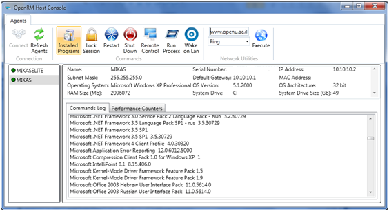

## Welcome to OpenRM Remote Monitoring project page!

**Overview**

OpenRM is Remote monitoring client/server application. 
Current features include:
* Performance monitor
* Remote execution
* Power control
* Computer inventory
* and more..

**Network Architecture**

